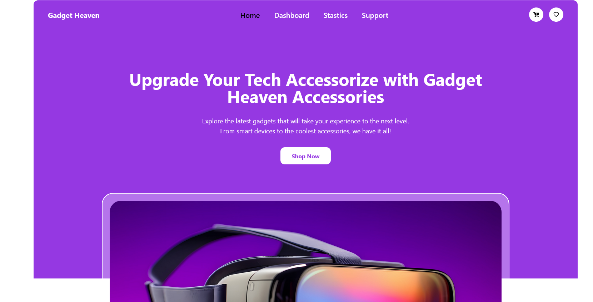

# Gadget Heaven

**Live Website:** [Gadget Heaven](https://gadget-heaven-pi.vercel.app/)  

## 📌 Project Overview

Gadget Heaven is a top-notch e-commerce platform designed to showcase and sell the latest gadgets. It provides users with an engaging and interactive experience, allowing them to explore various devices and make informed purchases. The platform features a dynamic UI, seamless navigation, and interactive data visualization for an enhanced shopping experience.

## 🖼 Screenshot  


## 📖 Table of Contents

- [Features](#features)
- [Technologies Used](#technologies-used)
- [React Fundamentals Used](#react-fundamentals-used)
- [Data Handling & Management](#data-handling--management)
- [Dependencies used](#dependencies-used)
- [Installation](#installation)


---

## ✨ Features

- **Dynamic Navigation Bar** – Adapts based on user location and state.
- **Composed Chart Integration** – Visual representation of product pricing and ratings.
- **Responsive Design** – Ensures seamless usability across devices.
- **Interactive Product Listing** – Detailed product views with sorting options.
- **User Support** – Contact form for queries and complaints.
- **Dashboard Functionality** – Includes "Add to Cart" and "Add to Wishlist" features.
- **Stock Management** – Products can only be added to the cart if they are available.

---

## 💻 Technologies Used

- **React.js** – Frontend framework for building UI components.
- **Tailwind CSS** – Styling and responsive design.
- **Recharts** – Data visualization for product insights.
- **Local Storage** – Persistent data handling for user preferences and cart management.

---

## ⚛️ React Fundamentals Used

- **JSX** – Used for structuring UI components.
- **Components** – Modular design for reusability and maintainability.
- **State Management** – `useState` for handling dynamic data.
- **Effect Hook** – `useEffect` for managing side effects like data fetching.
- **Routing** – `react-router-dom` for seamless navigation.
- **Context API** – For global state management and data sharing.

---

## 📊 Data Handling & Management

- **Context API** – Used for state management across the application.
- **Local Storage** – Stores cart items and user preferences for persistent data retention.

---
## 📦 Dependencies  
The project uses the following npm packages:  
```
@eslint
@types/react-dom
@types/react
@vitejs/plugin-react
animate.css
aos
autoprefixer
axios
daisyui
eslint-plugin-react-hooks
eslint-plugin-react-refresh
eslint-plugin-react
eslint
firebase
globals
localforage
lottie-react
match-sorter
postcss
react-countup
react-dom
react-icons
react-rating-stars-component
react-responsive-carousel
react-router-dom
react
sort-by
sweetalert2
swiper
tailwindcss
vite
```
---
##  Installation & Setup  
Follow these steps to run the project locally:  

### 1 Clone the Client Repository  
```
git clone https://github.com/mdimranictiu/Gadget-Heaven.git
cd Gadget-Heaven
```

### 3 Install Dependencies
```
npm install
```
### 4 Start the Development Server
```
npm run dev
```

 ## Resources & Links
📖 React Documentation: https://react.dev/
📖 Tailwind CSS Documentation: https://tailwindcss.com/
🔥 Firebase: https://firebase.google.com/

📌 Feel free to contribute, report issues, or share your feedback! 🚀


